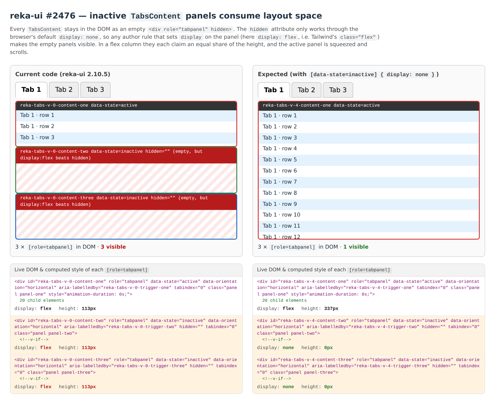
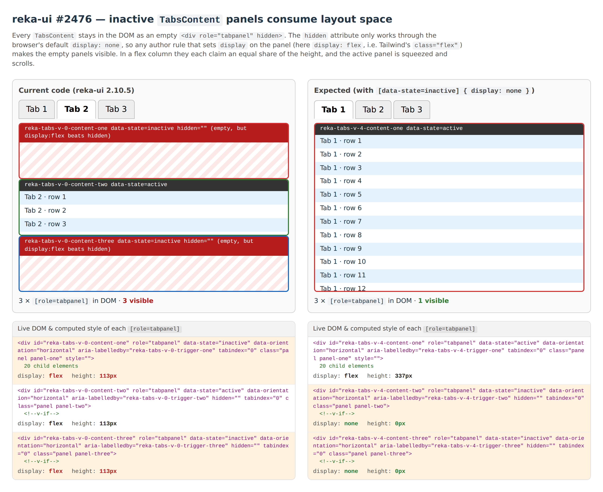

# reka-ui issue 2476 — inactive `TabsContent` panels consume layout space

Reproduction for https://github.com/unovue/reka-ui/issues/2476.

```bash
npm install
npm run dev
```

Reproduces on reka-ui 2.8.2 through 2.10.5 (current). No Tailwind, no `!important`,
no SSR. Plain Vue 3 SPA with a handful of CSS rules.

## What you see



Left: current code. Right: identical markup with `[data-state=inactive] { display: none }`.
The pane under each frame is generated live from the page: each panel's opening tag as
the browser holds it, its `innerHTML`, and its computed `display` and laid-out height.

Switching tabs moves the squeeze around but never removes it:



## What is happening

`TabsContent` renders its `Presence` with `force-mount` hardcoded, so every panel stays
in the DOM. With the default `unmountOnHide: true` the *content* is unmounted, but the
panel element itself remains as an empty `<div role="tabpanel" hidden>`:

```html
<div id="reka-tabs-v-0-content-one"   role="tabpanel" data-state="active"   class="panel">…20 rows…</div>
<div id="reka-tabs-v-0-content-two"   role="tabpanel" data-state="inactive" class="panel" hidden=""><!--v-if--></div>
<div id="reka-tabs-v-0-content-three" role="tabpanel" data-state="inactive" class="panel" hidden=""><!--v-if--></div>
```

The `hidden` attribute is only a user-agent stylesheet rule, `[hidden] { display: none }`.
Any author rule that sets `display` on the same element wins, whatever its specificity.
The repro's panel class is the everyday "scrollable tab body" recipe:

```css
.panel {
  display: flex;         /* Tailwind: flex          */
  flex-direction: column;/*           flex-col      */
  flex: 1;               /*           flex-1        */
  min-height: 0;         /*           min-h-0       */
  overflow-y: auto;      /*           overflow-y-auto */
}
```

That `display: flex` is enough. The two empty panels become flex items, each takes an
equal share of the column, and the active panel gets a third of the height and scrolls.

Tailwind v3's preflight has the same weakness: its `[hidden]:where(...) { display: none }`
rule is beaten by any later `.flex`. Tailwind v4 changed that rule to
`display: none !important` for exactly this reason.

## History

- The hardcoded `force-mount` arrived in
  [95263567](https://github.com/unovue/reka-ui/commit/95263567b337b2b5b547f7c81db9d5294359c70a)
  ("fix: TabsContent appearance on SSR", Nov 2023).
- [PR 2477](https://github.com/unovue/reka-ui/pull/2477) gated it on `isBrowser`. It was
  closed: the server would render every panel while the client renders only the active
  one, which is a hydration mismatch, and unmounting the panel element also breaks
  `unmountOnHide: false` and leaves `aria-controls` pointing at missing ids.
- Radix's `TabsContent` behaves the same way (its `Presence` always renders a
  render-prop child), so keeping the panel element is the intended design.

## What this repro asks for

1. **Docs.** `TabsRoot.unmountOnHide` says "the element will be unmounted". It is not;
   only the slot content is. The Tabs page should say that the panel element stays in the
   DOM under `hidden`, that any `display` rule on `TabsContent` defeats that, and show
   `data-[state=inactive]:hidden` as the fix.
2. **Optionally, an opt-in** on `TabsRoot` that unmounts the panel element as well and
   ties content registration to presence so `aria-controls` stays valid. Not
   environment-dependent, so no hydration mismatch; opt-in, so no behaviour change.

## Workarounds that need no `v-if`

Per panel, the maintainers' suggestion (Tailwind):

```html
<TabsContent value="one" class="flex flex-col flex-1 min-h-0 data-[state=inactive]:hidden">
```

Or once, globally, the Tailwind v4 preflight rule:

```css
[hidden]:where(:not([hidden="until-found"])) {
  display: none !important;
}
```

The right-hand frame in the screenshots uses the per-panel form.
